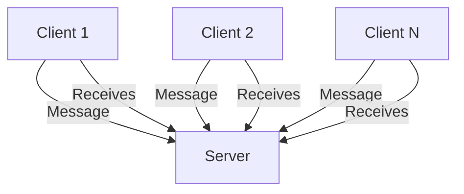
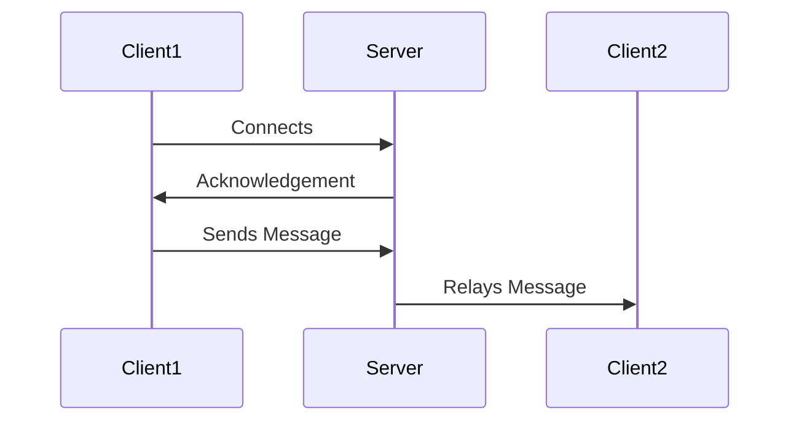
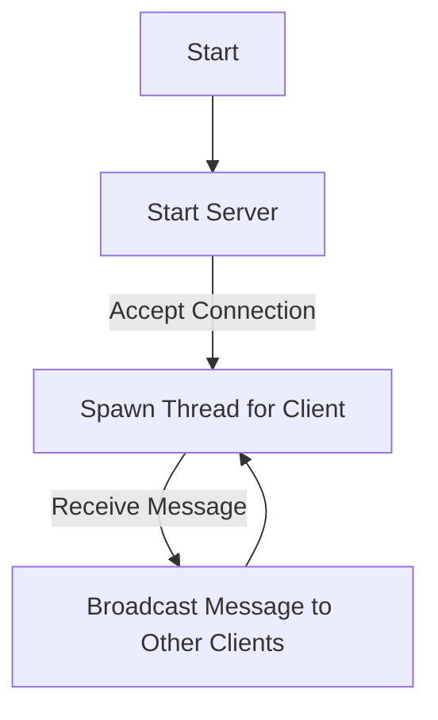

# Chat Application in Rust

Welcome to the **Chat Application in Rust** repository! This project demonstrates a simple TCP-based chat server and client implemented in Rust. The primary goal of this project is to showcase fundamental concepts of network programming in Rust, including multi-threading, inter-thread communication, and the use of TCP streams.

---

## Table of Contents

1. [Overview](#overview)
2. [Features](#features)
3. [Architecture](#architecture)
4. [Code Explanation](#code-explanation)
5. [How It Works](#how-it-works)
6. [Setup and Usage](#setup-and-usage)
7. [Diagrams and Workflow](#diagrams-and-workflow)
8. [Acknowledgements](#acknowledgements)

---

## Overview

This repository contains a basic chat application featuring:
- A multi-threaded server capable of handling multiple clients.
- A client program that connects to the server and sends/receives messages.
- A lightweight design to demonstrate TCP communication.

The chat server listens on `127.0.0.1:8080` and relays messages between connected clients.

---

## Features

- **Multi-threading**: Handles multiple clients concurrently using threads.
- **Non-blocking I/O**: Ensures responsive server and client behavior.
- **Inter-thread Communication**: Uses Rust's `mpsc` (multi-producer, single-consumer) channels for message passing.
- **Error Handling**: Gracefully handles client disconnections and communication errors.

---

## Architecture

The project consists of two main components:

1. **Server**:
   - Listens for incoming TCP connections.
   - Manages connected clients.
   - Relays messages received from one client to all others.

2. **Client**:
   - Connects to the server.
   - Sends messages typed by the user.
   - Displays messages received from the server.

### High-Level Architecture Diagram



---

## Code Explanation

### Server Code (`chat_cli/server/src/main.rs`)

#### Key Sections:
- **Constants**:
  ```rust
  const LOCAL: &str = "127.0.0.1:8080";
  const MSG_SIZE: usize = 32;
  ```
  - `LOCAL`: Defines the address and port where the server listens for connections.
  - `MSG_SIZE`: Limits the size of each message to 32 bytes.

- **TCP Listener**:
  ```rust
  let server = TcpListener::bind(LOCAL).expect("Listener failed to bind");
  ```
  - Binds the server to the specified address (`127.0.0.1:8080`).

- **Shared Client List**:
  ```rust
  let clients = Arc::new(Mutex::new(Vec::<std::net::TcpStream>::new()));
  ```
  - Uses `Arc` (atomic reference counting) and `Mutex` to manage a shared list of connected clients safely across threads.

- **Message Broadcasting**:
  ```rust
  thread::spawn(move || {
      for (sender_addr, msg) in rx {
          let mut clients = clients_ref.lock().unwrap();
          clients.retain(|mut client| {
              if client.peer_addr().unwrap() == sender_addr {
                  return true;
              }
              let mut buff = msg.clone().into_bytes();
              buff.resize(MSG_SIZE, 0);
              match client.write_all(&buff) {
                  Ok(_) => true,
                  Err(e) if e.kind() == ErrorKind::BrokenPipe => false,
                  Err(e) => {
                      eprintln!("Error sending message: {}", e);
                      false
                  }
              }
          });
      }
  });
  ```
  - A thread listens for messages from the `mpsc` channel and broadcasts them to all connected clients, except the sender.

- **Connection Handling**:
  ```rust
  for stream in server.incoming() {
      match stream {
          Ok(mut stream) => {
              let addr = stream.peer_addr().unwrap();
              println!("New client connected: {}", addr);
              clients.lock().unwrap().push(stream.try_clone().unwrap());
              ...
          }
      }
  }
  ```
  - Accepts incoming client connections and spawns a thread to handle each client.

#### Simplified Workflow:

1. The server accepts a new client connection.
2. The client is added to the shared list of connected clients.
3. Messages from the client are broadcast to all other clients.

---

### Client Code (`chat_cli/client/src/main.rs`)

#### Key Sections:
- **Connection Setup**:
  ```rust
  let mut client = TcpStream::connect(LOCAL).expect("Stream failed to connect");
  client.set_nonblocking(true).expect("Failed to initialize non-blocking");
  ```
  - Connects the client to the server and sets the connection to non-blocking mode for responsiveness.

- **Message Handling**:
  ```rust
  thread::spawn(move || loop {
      let mut buff = vec![0; MSG_SIZE];
      match client.read_exact(&mut buff) {
          Ok(_) => {
              let msg = String::from_utf8_lossy(&buff)
                  .trim_matches(char::from(0))
                  .to_string();
              println!("Message received: {}", msg);
          }
      }
  });
  ```
  - Spawns a thread to listen for incoming messages from the server.

- **User Input**:
  ```rust
  loop {
      let mut input = String::new();
      io::stdin().read_line(&mut input).expect("Failed to read line");
      let input = input.trim().to_string();
      if input.eq_ignore_ascii_case("exit") {
          println!("Exiting chat...");
          break;
      }
      tx_clone.send(input).expect("Failed to send message");
  }
  ```
  - Reads user input from the terminal and sends it to the server.

---

## How It Works

1. **Server**:
   - Starts listening for connections on `127.0.0.1:8080`.
   - Accepts client connections and spawns threads for each.
   - Receives messages from clients and broadcasts them to others.

2. **Client**:
   - Connects to the server.
   - Listens for incoming messages from the server.
   - Sends user input to the server.

---

## Setup and Usage

### Prerequisites
- Rust installed on your system. Install it from [here](https://www.rust-lang.org/tools/install).

### Running the Server
1. Navigate to the `chat_cli/server` directory:
   ```bash
   cd chat_cli/server
   ```
2. Run the server:
   ```bash
   cargo run
   ```

### Running the Client
1. Navigate to the `chat_cli/client` directory:
   ```bash
   cd chat_cli/client
   ```
2. Run the client:
   ```bash
   cargo run
   ```
3. Type messages in the terminal to send them. Type `exit` to leave the chat.

---

## Diagrams and Workflow

### Server-Client Interaction Workflow



### Program Flow Diagram



---

## Acknowledgements

This project was inspired by the need to understand:
- Rust's multi-threading model.
- TCP-based communication.
- Synchronization primitives like `Arc` and `Mutex`.

Special thanks to the Rust community for their excellent documentation and support.

---
