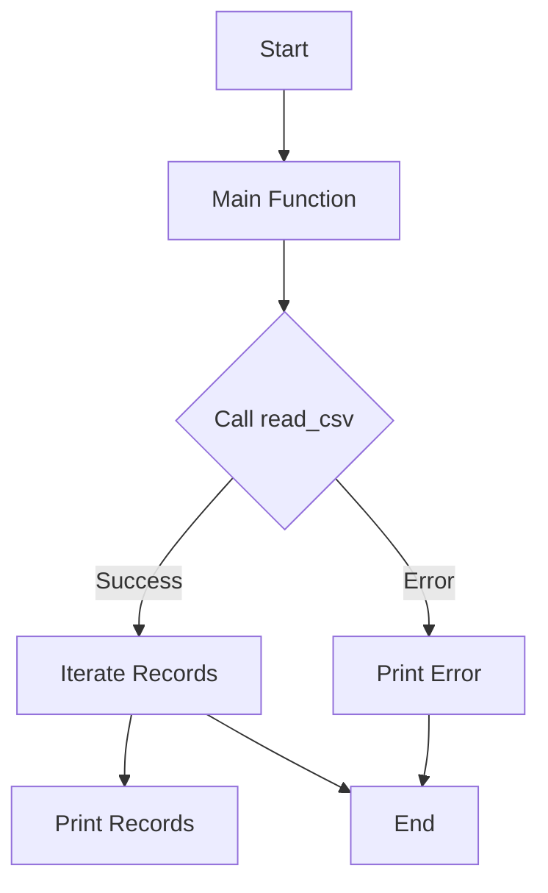

# CSV File Reader in Rust

Welcome to the **CSV File Reader** project! This repository demonstrates how to read and process CSV files using the powerful and efficient Rust programming language. This project is designed to serve as a beginner-friendly introduction to Rust's error handling, file I/O, and third-party crate usage.

---

## Table of Contents

1. [Introduction](#introduction)
2. [How It Works](#how-it-works)
   - [Code Walkthrough](#code-walkthrough)
3. [System Requirements](#system-requirements)
4. [Setup and Installation](#setup-and-installation)
5. [Usage](#usage)
6. [Diagrams and Flow](#diagrams-and-flow)
7. [Project Structure](#project-structure)
8. [Acknowledgments](#acknowledgments)

---

## Introduction

This project demonstrates how to read a CSV file in Rust using the `csv` crate. The program reads a file named `username.csv`, iterates through its records, and prints each record to the console. The code is designed to handle errors gracefully, ensuring that the application does not crash unexpectedly.

---

## How It Works

### Code Walkthrough

Let's break down the code step by step:

```rust
use std::error::Error;
use csv;
```

- **`use std::error::Error;`**: This imports Rust's `Error` trait, which allows us to work with errors generically. The `Box<dyn Error>` type is used later in the code to handle any kind of error dynamically.
- **`use csv;`**: This imports the `csv` crate, which is a Rust library for reading and writing CSV files.

---

```rust
fn main(){
    if let Err(err) = read_csv("./username.csv") {
        eprintln!("{}", err);
    }
}
```

- **`fn main()`**: The entry point of any Rust program.
- **Error Handling with `if let Err(err)`**: Calls the `read_csv` function and checks if it returns an error. If an error occurs, it is printed to the console using `eprintln!`, which outputs to the standard error stream.

---

```rust
fn read_csv(file_path: &str) -> Result<(), Box<dyn Error>> {
    let mut reader = csv::Reader::from_path(file_path)?;
    for result in reader.records() {
        let record = result?;
        println!("{:?}", record);
    }
    Ok(())
}
```

1. **`fn read_csv(file_path: &str)`**: This function takes the path to a CSV file as an input and returns a `Result`. If successful, it returns `Ok(())`. If an error occurs, it returns a `Box<dyn Error>`.
2. **`csv::Reader::from_path(file_path)?`**: Creates a CSV reader from the specified file path. The `?` operator propagates errors automatically if any occur.
3. **`for result in reader.records()`**: Iterates over the rows (or records) in the CSV file. Each record is wrapped in a `Result` to handle potential errors during iteration.
4. **`let record = result?`**: Unwraps the `Result`. If there’s an error, it will be propagated upwards.
5. **`println!("{:?}", record);`**: Prints the record to the console in a debug-friendly format.

---

## System Requirements

To run this project, ensure you have the following:

- Rust (1.65.0 or later)
- Cargo (Rust's package manager)
- A CSV file named `username.csv` in the project directory.

---

## Setup and Installation

1. Clone the repository:
   ```bash
   git clone https://github.com/malhotraarshdeepsingh/learning_rust.git
   cd learning_rust/csv_file_reader
   ```

2. Ensure Rust is installed:
   ```bash
   rustup --version
   ```

3. Build and run the program:
   ```bash
   cargo build
   cargo run
   ```

---

## Usage

1. Place a CSV file named `username.csv` in the project root directory. Example content:
   ```
   name,email,age
   John Doe,john@example.com,30
   Jane Smith,jane@example.com,25
   ```

2. Run the program:
   ```bash
   cargo run
   ```

3. Output:
   ```
   StringRecord(["John Doe", "john@example.com", "30"])
   StringRecord(["Jane Smith", "jane@example.com", "25"])
   ```

---

## Diagrams and Flow

### Program Flow Diagram

Below is a simplified flow diagram of the program:



### Architecture Overview

The program follows a simple modular structure:
- **Main Function**: Handles the program's entry point and error reporting.
- **`read_csv` Function**: Encapsulates the logic for reading and processing the CSV file.

---

## Project Structure

```plaintext
csv_file_reader/
├── src/
│   └── main.rs   # Main program logic
├── username.csv   # Example CSV file
├── Cargo.toml     # Rust dependencies and metadata
```

---

## Acknowledgments

- [Rust Lang](https://www.rust-lang.org/) for providing an amazing systems programming language.
- The Rust community and contributors for maintaining the `csv` crate.
- [Arshdeep Singh Malhotra](https://github.com/malhotraarshdeepsingh) for creating this repository.

---

Feel free to contribute to this project and make it even better! Happy coding!
