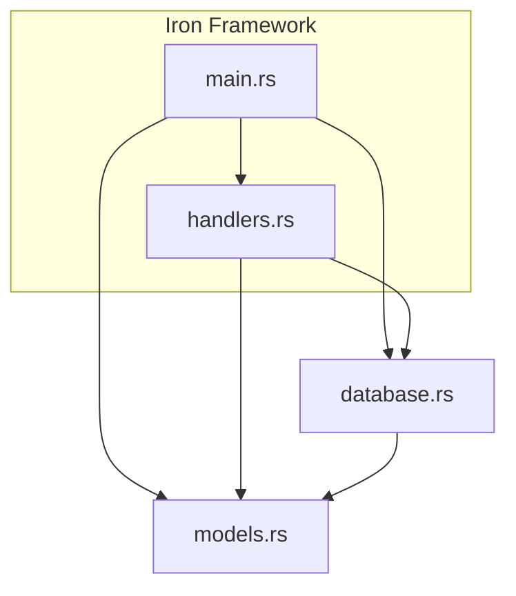
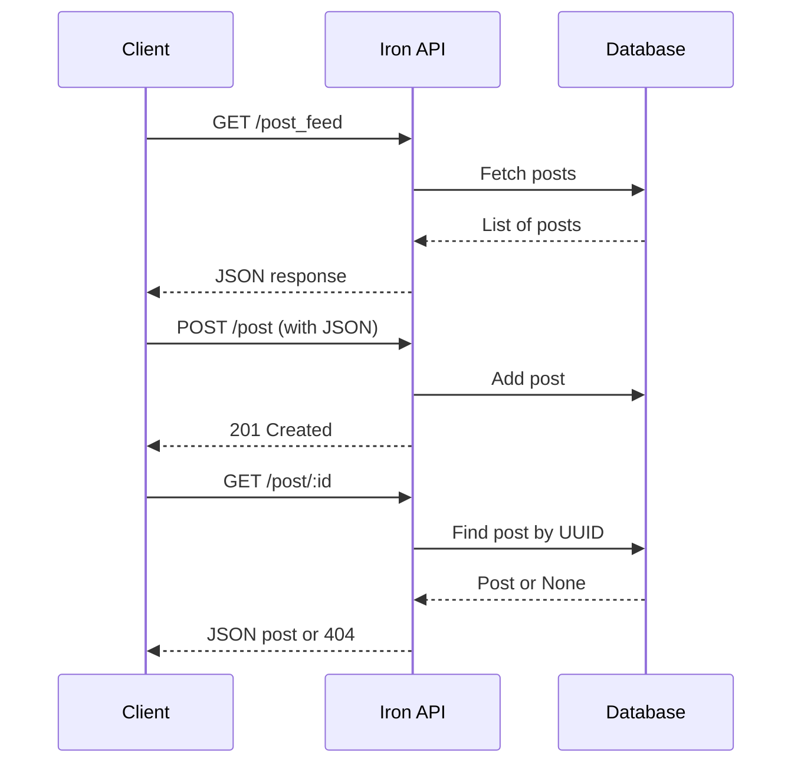

# Iron API - Learning Rust

[](https://www.rust-lang.org/)
[](https://github.com/iron/iron)
[](LICENSE)

---

## Table of Contents

- [Project Overview](#project-overview)
- [Architecture](#architecture)
- [Code Walkthrough](#code-walkthrough)
  - [Models](#modelsrs)
  - [Database](#databasers)
  - [Handlers](#handlersrs)
  - [Main Entry Point](#mainrs)
- [Endpoints](#endpoints)
- [Setup & Running](#setup--running)
- [Flow Diagram](#flow-diagram)
- [Acknowledgements](#acknowledgements)
- [License](#license)

---

## Project Overview

This project is a simple RESTful API built with Rust using the Iron web framework. It demonstrates core concepts in Rust web development such as routing, HTTP handling, middleware, and state management. The API provides basic functionality to create, retrieve, and list "Post" items, which are models representing blog posts.

---

## Architecture



- **main.rs** initializes the server, sets up routes, and middleware.
- **handlers.rs** contains logic for each REST endpoint.
- **models.rs** defines the `Post` struct and its methods.
- **database.rs** provides an in-memory database abstraction.

---

## Code Walkthrough

### [models.rs](https://github.com/malhotraarshdeepsingh/learning_rust/blob/0e53fd920bfb1721f68627a928cf54132f8f291b/iron_api/src/models.rs)

```rust
use chrono::DateTime;
use chrono::Utc;
use serde::{Deserialize, Serialize};
use uuid::Uuid;

#[derive(Clone, Serialize, Deserialize, Debug)]
pub struct Post {
    title: String,
    body: String,
    author: String,
    datetime: DateTime<Utc>,
    uuid: Uuid,
}
```
- **Imports**: Handling dates (`chrono`), serialization (`serde`), and unique IDs (`uuid`).
- **Post struct**: The core model, representing a blog post with all relevant fields.
- `#[derive(Clone, Serialize, Deserialize, Debug)]`: Enables copying, JSON (de)serialization, and debug printing.

```rust
impl Post {
    pub fn new(title: &str, body: &str, author: &str, datetime: DateTime<Utc>, uuid: Uuid) -> Post { ... }
    pub fn uuid(&self) -> &Uuid { ... }
}
```
- **new**: Factory method for creating a `Post`.
- **uuid**: Getter for the post's unique ID.

---

### [database.rs](https://github.com/malhotraarshdeepsingh/learning_rust/blob/0e53fd920bfb1721f68627a928cf54132f8f291b/iron_api/src/database.rs)

```rust
use crate::models::Post;

#[derive(Clone, Debug)]
pub struct Database {
    posts: Vec<Post>,
}
```
- **Database struct**: Simple wrapper around a vector of posts.

```rust
impl Database {
    pub fn new() -> Database { ... }
    pub fn add_post(&mut self, post: Post) { ... }
    pub fn posts(&self) -> &Vec<Post> { ... }
}
```
- **new**: Initializes an empty database.
- **add_post**: Adds a post to the database.
- **posts**: Returns all stored posts.

---

### [handlers.rs](https://github.com/malhotraarshdeepsingh/learning_rust/blob/0e53fd920bfb1721f68627a928cf54132f8f291b/iron_api/src/handlers.rs)

#### Macros

- `try_handler!` - Error handling, wraps expressions and returns HTTP errors as needed.
- `lock!` - Locks a mutex for shared database access.
- `get_http_param!` - Gets HTTP route parameters safely.

#### Handler Structs

- `Handlers` groups all endpoint handlers (`PostFeedHandler`, `PostPostHandler`, `PostHandler`).
- Each handler holds an `Arc<Mutex<Database>>` for thread-safe state.

#### Endpoint Logic

- **GET /post_feed** (`PostFeedHandler`): Returns all posts as JSON.
- **POST /post** (`PostPostHandler`): Accepts a JSON post, adds it to the database.
- **GET /post/:id** (`PostHandler`): Returns a post by UUID if found, else 404.

#### Middleware

- `JsonAfterMiddleware`: Ensures responses have the correct `Content-Type: application/json`.

---

### [main.rs](https://github.com/malhotraarshdeepsingh/learning_rust/blob/0e53fd920bfb1721f68627a928cf54132f8f291b/iron_api/src/main.rs)

- **Module setup**: Import all submodules.
- **Logger setup**: Initializes request logging.
- **Database init**: Creates the database and seeds it with two test posts.
- **Handler grouping**: Bundles handlers, passes database reference.
- **Router setup**: Maps endpoints to handlers:
  - `/post_feed` (GET): List all posts.
  - `/post` (POST): Add new post.
  - `/post/:id` (GET): Get post by ID.

- **Middleware chain**: Adds logging and JSON response middleware.
- **Iron server init**: Binds to `localhost:8000`.

---

## Endpoints

| Method | Route            | Description                | Body           |
|--------|------------------|---------------------------|----------------|
| GET    | `/post_feed`     | List all posts            | None           |
| POST   | `/post`          | Add a new post            | JSON `Post`    |
| GET    | `/post/:id`      | Get a post by UUID        | None           |

---

## Setup & Running

1. **Install Rust**: [rustup.rs](https://rustup.rs/)
2. **Clone Repo**:
   ```sh
   git clone https://github.com/malhotraarshdeepsingh/learning_rust.git
   cd learning_rust/iron_api
   ```
3. **Run Server**:
   ```sh
   cargo run
   ```
4. **Test Endpoints**:
   - Use [curl](https://curl.se/), [Postman](https://www.postman.com/) or any HTTP client.

#### Example Request

```sh
curl http://localhost:8000/post_feed
```

---

## Flow Diagram



---

## Acknowledgements

- [Iron Web Framework](https://github.com/iron/iron)
- [Rust Language](https://www.rust-lang.org/)
- [Serde](https://serde.rs/) for serialization
- [chrono](https://crates.io/crates/chrono) for date/time handling
- [uuid](https://crates.io/crates/uuid) for unique IDs
- [logger](https://github.com/iron/logger) for request logging
- [router](https://github.com/iron/router) for routing

Special thanks to the Rust community for extensive documentation and support.

---

## License

This project is licensed under the MIT License. See [LICENSE](LICENSE) for details.

---
