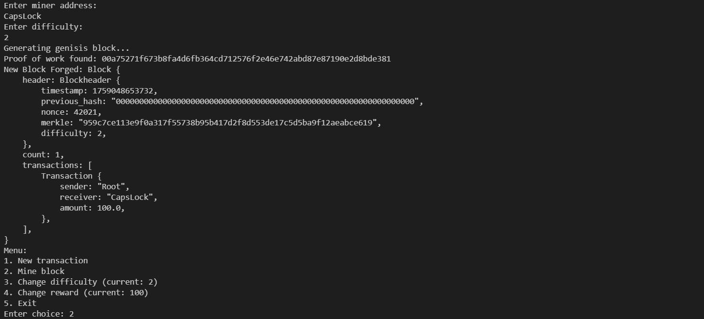

# Toy Blockchain in Rust

Welcome to the **Toy Blockchain** project! This repository implements a simple blockchain from scratch using Rust. The project is designed for educational purposes to help you understand the fundamental concepts behind blockchain technology.

---

## Table of Contents
1. [Introduction](#introduction)
2. [How It Works](#how-it-works)
   - [Code Explanation](#code-explanation)
3. [Getting Started](#getting-started)
   - [Prerequisites](#prerequisites)
   - [Running the Application](#running-the-application)
4. [Project Architecture](#project-architecture)
5. [Diagrams and Visuals](#diagrams-and-visuals)
6. [Acknowledgments](#acknowledgments)

---

## Introduction

This project is a **toy blockchain** implementation built for learning purposes. It includes features such as:
- Mining blocks with proof-of-work
- Adding transactions
- Adjustable difficulty for mining
- Adjustable mining rewards
- A basic command-line interface for interacting with the blockchain

The project is written in Rust, leveraging its safety and performance features.

---

## How It Works

### Code Explanation

Below is a detailed explanation of the core components:

#### 1. **Transaction Struct**
```rust
#[derive(Serialize, Deserialize, Debug, Clone)]
struct Transaction {
    sender: String,
    receiver: String,
    amount: f64,
}
```
- **Purpose**: Represents a transaction on the blockchain.
- **Fields**:
  - `sender`: The address of the sender.
  - `receiver`: The address of the receiver.
  - `amount`: The amount of cryptocurrency being transferred.

#### 2. **Blockheader Struct**
```rust
#[derive(Serialize, Deserialize, Debug, Clone)]
pub struct Blockheader {
    timestamp: i64,
    previous_hash: String,
    nonce: u64,
    merkle: String,
    difficulty: u32,
}
```
- **Purpose**: Stores metadata for a block.
- **Fields**:
  - `timestamp`: The time the block was created.
  - `previous_hash`: Hash of the previous block.
  - `nonce`: The proof-of-work nonce.
  - `merkle`: Merkle root of the block's transactions.
  - `difficulty`: Mining difficulty for the block.

#### 3. **Block Struct**
```rust
#[derive(Serialize, Deserialize, Debug, Clone)]
pub struct Block {
    header: Blockheader,
    count: u32,
    transactions: Vec<Transaction>,
}
```
- **Purpose**: Represents a block in the blockchain.
- **Fields**:
  - `header`: Metadata of the block.
  - `count`: Number of transactions in the block.
  - `transactions`: A list of transactions.

#### 4. **Chain Struct**
```rust
pub struct Chain {
    pub chain: Vec<Block>,
    pub difficulty: u32,
    pub current_transactions: Vec<Transaction>,
    pub miner_address: String,
    pub reward: f64,
}
```
- **Purpose**: Represents the entire blockchain.
- **Fields**:
  - `chain`: The sequence of blocks.
  - `difficulty`: Current mining difficulty.
  - `current_transactions`: List of pending transactions.
  - `miner_address`: Address of the miner.
  - `reward`: Reward for mining a block.

---

### Key Methods in `Chain`

#### `new`
```rust
pub fn new(miner_address: String, reward: f64, difficulty: u32) -> Chain
```
- **Purpose**: Initializes a new blockchain with a genesis block.
- **How It Works**:
  - Creates an empty chain.
  - Adds the first block (genesis block).

#### `new_transaction`
```rust
pub fn new_transaction(&mut self, sender: String, receiver: String, amount: f64) -> bool
```
- **Purpose**: Adds a new transaction to the list of current transactions.

#### `generate_new_block`
```rust
pub fn generate_new_block(&mut self) -> bool
```
- **Purpose**: Mines a new block and adds it to the chain.
- **How It Works**:
  1. Creates a new block header with the last block's hash.
  2. Adds a reward transaction for the miner.
  3. Appends pending transactions to the block.
  4. Computes the Merkle root of transactions.
  5. Solves the proof-of-work puzzle (finds a valid nonce).

#### `proof_of_work`
```rust
pub fn proof_of_work(header: &mut Blockheader)
```
- **Purpose**: Solves the proof-of-work puzzle by finding a hash with a number of leading zeros equal to the difficulty.
- **How It Works**:
  - Iteratively hashes the block header with different nonce values.
  - Stops when a hash with the required number of leading zeros is found.

#### `hash`
```rust
pub fn hash<T: serde::Serialize>(item: &T) -> String
```
- **Purpose**: Computes the SHA-256 hash of any serializable object.

---

### `main.rs` File

The main file provides a **command-line interface** for interacting with the blockchain.

#### Key Features:
1. **User Input**:
   - Prompts the user for miner address, difficulty, and reward.
   - Displays a menu for actions like adding transactions, mining blocks, and updating parameters.

2. **Interactive Menu**:
   - `1`: Add a new transaction.
   - `2`: Mine a new block.
   - `3`: Update mining difficulty.
   - `4`: Update mining reward.
   - `5`: Exit the program.

---

## Getting Started

### Prerequisites
- **Rust**: Ensure you have Rust installed. You can install it using [Rustup](https://rustup.rs/).

### Running the Application
1. Clone the repository:
   ```bash
   git clone https://github.com/malhotraarshdeepsingh/learning_rust.git
   cd learning_rust/toy_blockchain
   ```
2. Build the project:
   ```bash
   cargo build
   ```
3. Run the application:
   ```bash
   cargo run
   ```

---

## Project Architecture

The project follows a modular architecture:
1. **Blockchain Module (`blockchain.rs`)**:
   - Contains the core blockchain logic.
   - Defines the `Transaction`, `Blockheader`, `Block`, and `Chain` structs.

2. **Main File (`main.rs`)**:
   - Provides a command-line interface for user interaction.

3. **Assets (`snap/`)**:
   - Includes screenshots and visuals for documentation.

---

## Diagrams and Visuals

### Blockchain Structure
```plaintext
+-------------------+       +-------------------+       +-------------------+
|      Block 0      | ----> |      Block 1      | ----> |      Block 2      |
|-------------------|       |-------------------|       |-------------------|
| Previous Hash: 0  |       | Previous Hash: H0 |       | Previous Hash: H1 |
| Nonce: 12345      |       | Nonce: 67890      |       | Nonce: 54321      |
| Transactions: [..]|       | Transactions: [..]|       | Transactions: [..]|
+-------------------+       +-------------------+       +-------------------+
```

### Proof-of-Work Process


### Merkle Tree Construction


---

## Acknowledgments

This project was created for educational purposes to demonstrate the fundamental concepts of blockchain technology. Special thanks to:
- The Rust community for maintaining excellent libraries like `serde` and `sha2`.
- Open-source contributors for inspiring blockchain implementations.

---

Feel free to fork, contribute, or suggest improvements!
