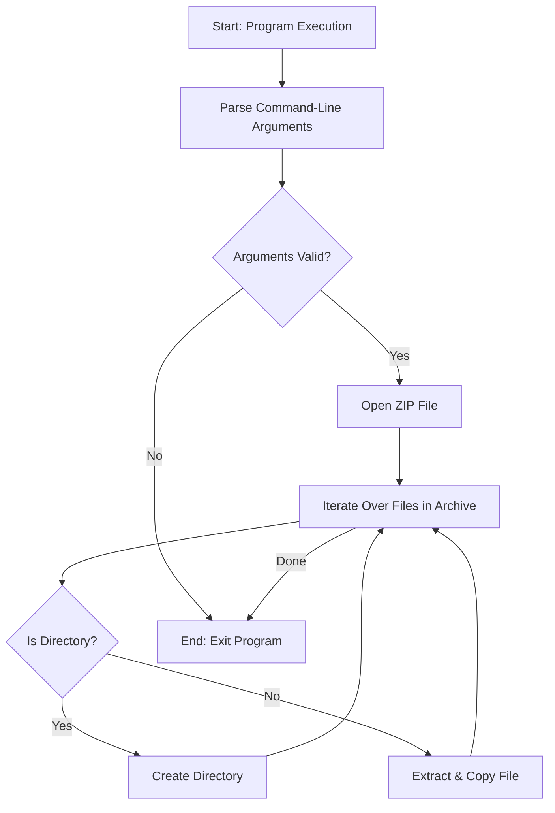

# Learning Rust: Unzip Utility

Welcome to the **Learning Rust** repository! This project is a simple yet powerful example of how to create a ZIP file extraction utility in Rust. The code demonstrates critical aspects of Rust programming, including file handling, error management, and working with external crates.


---

## Table of Contents

- [About the Project](#about-the-project)
- [How It Works](#how-it-works)
  - [Detailed Code Walkthrough](#detailed-code-walkthrough)
  - [Flow Diagram](#flow-diagram)
- [Getting Started](#getting-started)
  - [Prerequisites](#prerequisites)
  - [Installation](#installation)
- [Usage](#usage)
- [Architecture](#architecture)
- [Acknowledgements](#acknowledgements)
  
---

## About the Project

This project is designed for Rust learners to understand how to build a command-line utility to extract ZIP archives. The code uses fundamental Rust programming concepts and the `zip` crate to handle ZIP file operations. 

The utility:
- Reads ZIP files provided as command-line arguments.
- Extracts files/directories while preserving directory structure.
- Handles errors gracefully, ensuring robust execution.

---

## How It Works

This section explains how the code works and provides a detailed walkthrough of the key components.

### Detailed Code Walkthrough

1. **Main Function**
    ```rust
    fn main() {
        std::process::exit(real_main());
    }
    ```
    - The `main` function is the entry point of the program.
    - It calls the `real_main` function, and its exit status determines the program's success or failure.

2. **Command-Line Argument Parsing**
    ```rust
    let args: Vec<_> = std::env::args().collect();

    if args.len() != 2 {
        eprintln!("Usage: {} <filename>", args[0]);
        return 1;
    }
    ```
    - `std::env::args()` retrieves command-line arguments.
    - If the number of arguments is not exactly 2 (program name + filename), an error message is displayed, and the program exits with status `1`.

3. **File Handling and Zip Archive Loading**
    ```rust
    let filename = std::path::Path::new(&*args[1]);
    let file = fs::File::open(&filename).unwrap();
    let mut archive = zip::ZipArchive::new(file).unwrap();
    ```
    - The provided filename is converted into a `Path` object.
    - The file is opened using `fs::File::open`, and `zip::ZipArchive` is initialized to manage the ZIP file.

4. **File Iteration and Extraction**
    ```rust
    for i in 0..archive.len() {
        let mut file = archive.by_index(i).unwrap();
        let outpath = match file.enclosed_name() {
            Some(path) => path.to_owned(),
            None => continue,
        };
        ...
    }
    ```
    - Iterates over all files in the ZIP archive.
    - Extracts the file's name and path using `file.enclosed_name()`.
    - Skips files with invalid paths.

5. **Handling Directories and Files**
    ```rust
    if (&*file.name()).ends_with('/') {
        println!("File {} extracted to \"{}\"", i, outpath.display());
        fs::create_dir_all(&outpath).unwrap();
    } else {
        println!("File {} extracted to \"{}\" ({} bytes)", i, outpath.display(), file.size());
        if let Some(p) = outpath.parent() {
            if !p.exists() {
                fs::create_dir_all(&p).unwrap();
            }
        }
        let mut outfile = fs::File::create(&outpath).unwrap();
        io::copy(&mut file, &mut outfile).unwrap();
    }
    ```
    - Checks if the file is a directory (indicated by a trailing `/`).
    - Creates necessary directories using `fs::create_dir_all`.
    - Extracts regular files by creating them and copying their content from the ZIP archive.

6. **Unix-Specific Permissions**
    ```rust
    #[cfg(unix)]
    {
        use std::os::unix::fs::PermissionsExt;
        if let Some(mode) = file.unix_mode() {
            fs::set_permissions(&filename, fs::Permissions::from_mode(mode)).unwrap();
        }
    }
    ```
    - Uses platform-specific code (only on Unix systems) to set file permissions based on the original ZIP archive metadata.

7. **Exit Status**
    ```rust
    return 0;
    ```
    - Returns `0` to indicate successful execution.

---

### Flow Diagram

Below is a flow diagram to help visualize the program's workflow:



---

## Getting Started

### Prerequisites

Ensure you have the following installed:
- [Rust](https://www.rust-lang.org/tools/install)
- Cargo (Rust's package manager)

### Installation

1. Clone the repository:
    ```bash
    git clone https://github.com/malhotraarshdeepsingh/learning_rust.git
    cd learning_rust/unzip
    ```

2. Build the project:
    ```bash
    cargo build --release
    ```

---

## Usage

Run the program with the following command:

```bash
./target/release/unzip <filename>
```

Example:

```bash
./target/release/unzip archive.zip
```

---

## Architecture

The project is structured as follows:

```
learning_rust/
├── unzip/
│   ├── src/
│   │   └── main.rs     # Main program source code
│   └── Cargo.toml      # Rust project configuration
```

### Key Components
- **`main.rs`:** Core logic for extracting ZIP files.
- **`Cargo.toml`:** Specifies dependencies like the `zip` crate.

---

## Acknowledgements

This project was inspired by the need for a simple ZIP extraction tool and serves as a learning resource for Rust development. Special thanks to:
- The Rust community for their excellent documentation and support.
- The authors of the `zip` crate for providing a robust library for handling ZIP archives.

---

Happy coding! 🚀
